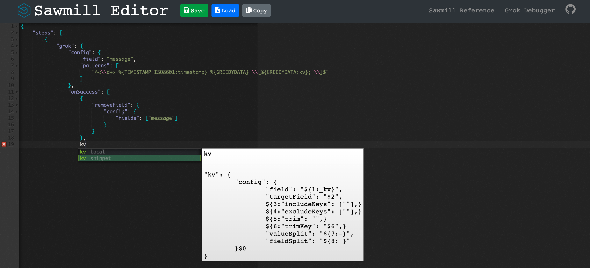

# Sawmill Editor
Create, save, and share [Sawmills](https://github.com/logzio/sawmill).

Editor functionality was sourced from [ace-builds](https://github.com/ajaxorg/ace-builds) and modified with snippets for writing Sawmills.



## Installation

### Run locally:
Requires [node.js](https://nodejs.org/en/)
```
git clone https://github.com/cjslack/sawmill-editor.git
npm install
node server.js
```

### Using Docker:
```
docker build -t sawmill-editor https://github.com/cjslack/sawmill-editor.git
docker run -d -p 443:3000 sawmill-editor
```
